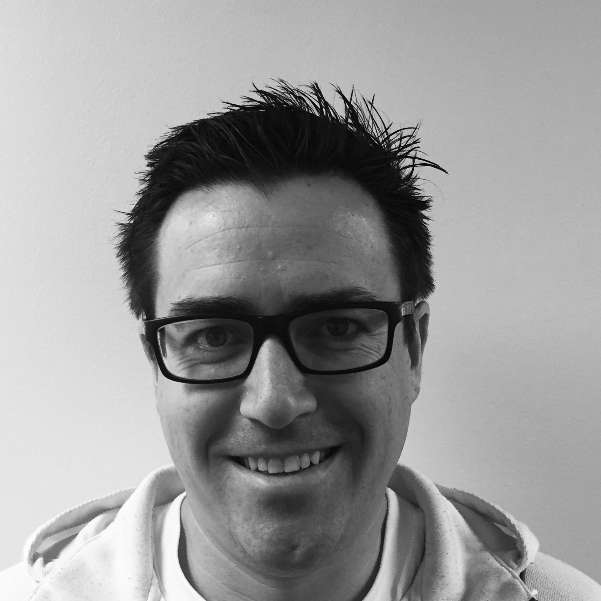

 [Home](https://frontrangegeosciences.com/) | [DeepTrace](https://frontrangegeosciences.com/DeepTrace) | [Phoenix](https://frontrangegeosciences.com/Phoenix)

---

# Company
Front Range Geosciences is located in Boulder, CO. We are a small company focused on near-surface modeling and data processing, working on innovative new software tools and methodologies for exploration geoscience. We are a sister company to [Xtreme Geo](https://xtgeo.com/), a recognized leader in refraction statics software.

## People

Dr. Matt Duiker has over 30 years of experience in geoscience technology development, having founded numerous leading geophysical companies, such as XtremeGeo, Maverick Geophysics, and Renegade Geophysics. Dr. Duiker previously created the FLATIRONS™ Refraction Statics software package, the industry-leading near surface geophysical processing suite. Dr. Duiker holds a Ph.D. in Physics from the University of Colorado and a B.S. in Electrical Engineering from Caltech.

Branton Demoss is a physicist and software developer who specializes in artificial intelligence. His academic research spanned a variety of topics in theoretical and computational physics, from high energy particle physics simulations to knot theory. He previously read for an MMathPhys at the University of Oxford and for a BA in Math and Physics at the University of Colorado.

Ding Liu is a mathematician and software developer who specializes in near surface geophysical modeling. He brings his years of expertise as the lead developer of FLATIRONS™ to Front Range Geosciences, where he contributes to the development of Phoenix. He holds a BA in Mathematics from the University of Colorado.

Tom Zang is the controller of Front Range Geosciences and its sister company, XtremeGeo. He got his start in the industry as an accountant and field engineer technician at Apex HiPoint (Sigma Cubed). He graduated from Fort Lewis College with a degree in International Business.

---

 [Home](https://frontrangegeosciences.com/) | [DeepTrace](https://frontrangegeosciences.com/DeepTrace) | [Phoenix](https://frontrangegeosciences.com/Phoenix)
 

 contact: [info@frontrangegeosciences.com](mailto:info@frontrangegeosciences.com) | 720-627-5035 | Boulder, CO, USA

