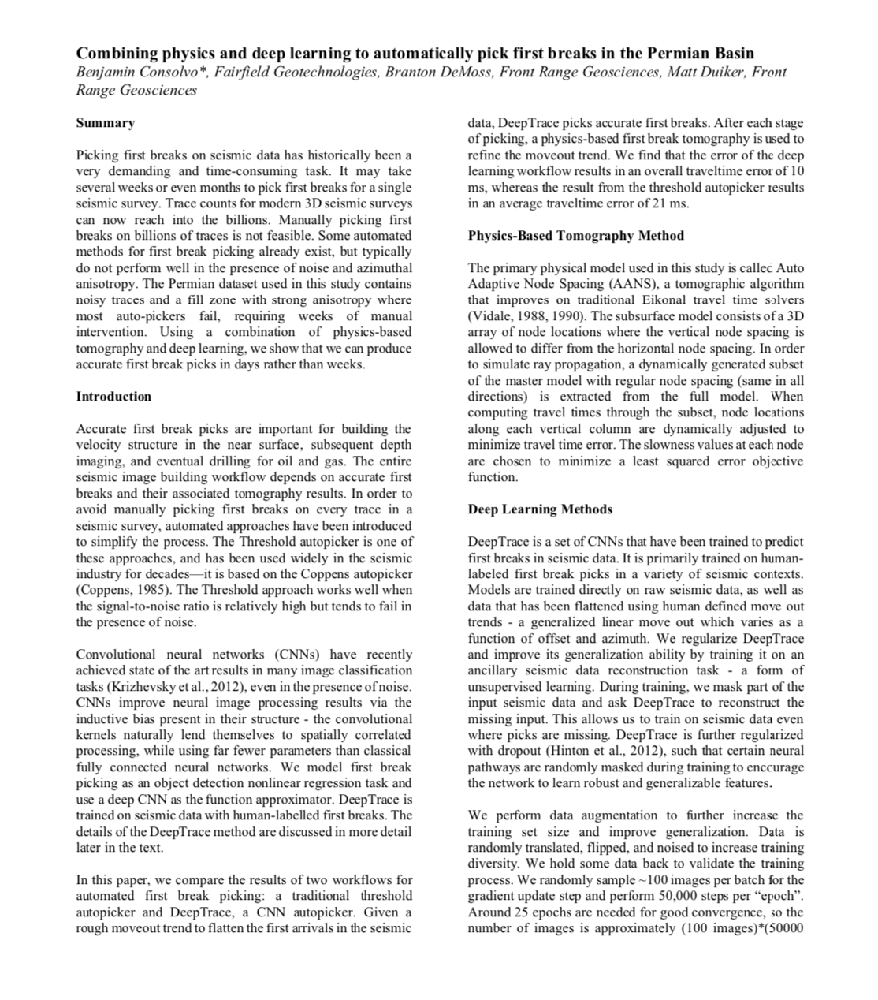
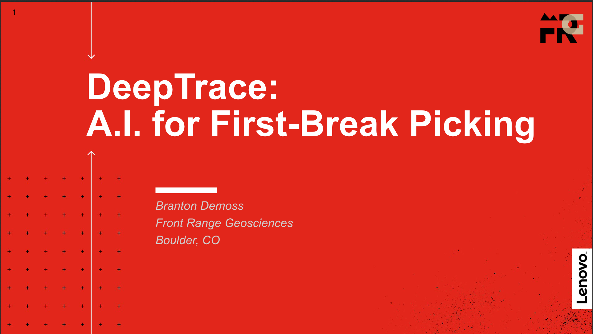

---
header-includes:
        <!-- Global site tag (gtag.js) - Google Analytics -->
        
        
	<link rel="icon" sizes="16x16 32x32" type="image/png" href="../FRGLogo.ico">
---

[Home](https://frontrangegeosciences.com/) | [DeepTrace](https://frontrangegeosciences.com/DeepTrace) | [Phoenix](https://frontrangegeosciences.com/Phoenix) | [Company](https://frontrangegeosciences.com/About)

# DeepTrace
<h3 style="text-align-last: center;">AI for First Break Picking</h3>

*First breaks identified by DeepTrace*

DeepTrace is a breakthrough application of deep learning for picking arrival times in seismic data. Integrated with FRG's Phoenix Refraction Statics program, DeepTrace can pick billions of traces per hour at human quality. 

Users can further train DeepTrace on their historical data to continually refine DeepTrace's picking abilities in diverse geophysical contexts. 

## Motivation
Geophysicists often spend weeks manually picking and adjusting first breaks in seismic data to produce the highest-quality models. As surveys grow ever-larger in size, this process fails to scale and often becomes a bottleneck in the near-surface processing workflow.

DeepTrace is an AI that leverages modern breakthroughs in computer vision to finally enable automatic picking at human-quality. DeepTrace has been trained on terabytes of manually picked seismic data in a diverse set of geologic contexts and has learned how to pick first breaks "like a human would". DeepTrace's average disagreement with manual human picks is $< 5 ms$, approaching the resolution limit of most seismic data.

DeepTrace can pick in hours what humans take weeks, or in some cases months, to process. By scaling GPU compute resources with dataset size, any survey can be automatically picked by DeepTrace, freeing up valuable human time to explore more complex geophysical modeling decisions.

By its nature DeepTrace can continue to learn from new data sources - by training their own copy of DeepTrace on their historical data archives, processors can leverage decades of effort spent picking first breaks to produce DeepTrace models that out-perform humans in most contexts.

## Probability
<video width="900" loop autoplay muted playsinline>
       <source src="dtprob.mp4" type="video/mp4">
</video>

*First break probability distribution predicted by DeepTrace*

In addition to producing picks directly, DeepTrace has also been trained to output probability distributions over traces. The probability distribution encodes DeepTrace's opinion about different likely first breaks, which can account for uncertainty due to noise, ambiguous arrivals, and shingling.

These probability distributions can be used in a few different ways:

 - Users can automatically kill picks with high spread, i.e. picks which are inherently ambiguous in their arrival, or which DeepTrace is uncertain about.
 - Users can optionally generate a tomographic model *using the full probability distribution in the inversion*: Phoenix's tomography can incorporate probability distributions during the inversion phase, so that the resultant velocity model automatically accounts for the uncertainty in arrival time, producing a much richer representation from the full distribution rather than a single pick.

Using the full probability distribution, geophysicists' time can be saved by reducing complex and ambiguous picking decisions: with the distributional approach, all possibilities are accounted for simultaneously.

### Shingling
<video width="900" loop autoplay muted playsinline>
       <source src="shinglingprob.mp4" type="video/mp4">
</video>

*Bimodal probability distribution predicted by DeepTrace in the presence of shingling*

In seismic data with strong shingling, a unique first break event can be hard to identify. Rather than make an arbitrary choice between multiple potential candidates, DeepTrace's predicted probability distribution automatically handles multimodal energy arrival.

Using the probabilistic tomographic inversion in Phoenix, your picking and velocity models will automatically account for strong shingling and ambiguous arrivals.

## Information
Read our case-study using Phoenix and DeepTrace to process a difficult survey produced in partnership with Fairfield here:

We have also released results using Phoenix and DeepTrace to process a survey in partnership with Schlumberger. [Download the presentation here (27MB)](https://frontrangegeosciences.com/Phoenix/FRG_Phoenix_DeepTrace.pptx).

We partnered with [Lenovo](https://www.lenovo.com) at SEG 2019 to demonstrate how GPU compute accelerates neural networks like DeepTrace. You can find our presentation here:

## Key Features
DeepTrace's key features include:

- Speed
  - Leveraging GPUs to parallelize complex neural network computation, DeepTrace can be easily distributed across many GPUs, allowing unlimited scaling with user hardware. Using a modern 6 GPU cluster, DeepTrace can pick billions of traces per hour.
- Quality
  - Existing autopickers cannot identify first breaks in geologically complex and noisy seismic data. DeepTrace has learned from terabytes of manually picked human data to see through the noise and identify first breaks in even the most difficult scenarios.
- Continuous training
  - FRG is constantly training DeepTrace to improve its performance. We are continually refining the neural architecture, training data, and other hyperparameters to improve DeepTrace.
  - Uniquely, DeepTrace users can *train DeepTrace on their own seismic data library*, leveraging their unique collection of picked seismic data to improve DeepTrace on data only they have access to.
- Integration with Phoenix
  - DeepTrace integrates seamlessly with our Phoenix Refraction Statics software to pick seismic data in the unified Phoenix environment. There is no need to export/import data from DeepTrace - it just works!

To request a demo of DeepTrace or enquire about pricing, please [contact us](mailto:info@frontrangegeosciences.com).

## Documentation
[Current DeepTrace users can find the documentation here.](https://frontrangegeosciences.com/DeepTrace/Docs/)

---

T: +1 720.627.5035
 [info@frontrangegeosciences.com](mailto:info@frontrangegeosciences.com)
 

