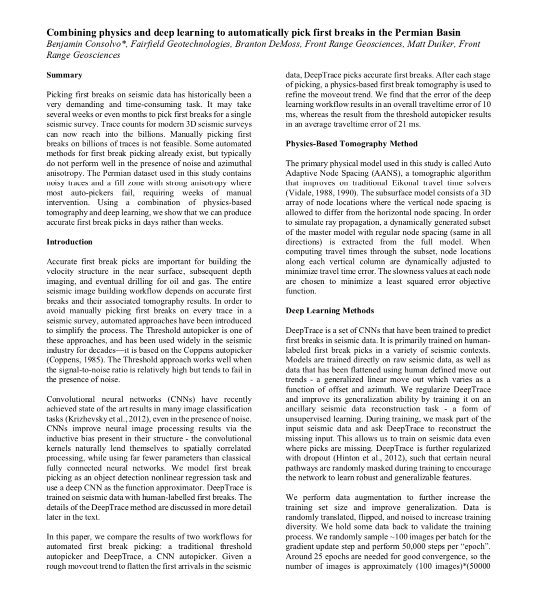

---
header-includes:
        <!-- Global site tag (gtag.js) - Google Analytics -->
        
        
	<link rel="icon" sizes="16x16 32x32" type="image/png" href="../FRGLogo.ico">
---

[Home](https://frontrangegeosciences.com/) | [DeepTrace](https://frontrangegeosciences.com/DeepTrace) | [Phoenix](https://frontrangegeosciences.com/Phoenix) | [Company](https://frontrangegeosciences.com/About)

# Phoenix Refraction Statics

*Velocity inversion found using Phoenix ANS tomography*

Phoenix is a near surface modeling and refraction statics package designed for the next generation of seismic surveys. Designed to run the largest datasets in hours instead of weeks, Phoenix offers unheard of performance.

With vastly superior geophysical modeling capabilities, integration of additional well-log data as constraints, and seamless survey merges, Phoenix offers seismic processing options that can't be found anywhere else.

Every day tasks such as data import and survey merges, delay time and tomographic modeling, picking and QC procedures have all been parallelized and distributed, leading to speedup factors of **5-50x** over competitive software such as Flatirons.

Read our case-study using Phoenix and DeepTrace to process a difficult survey produced in partnership with Fairfield here:

We have also released results using Phoenix and DeepTrace to process a survey in partnership with Schlumberger. [Download the presentation here (27MB)](https://frontrangegeosciences.com/Phoenix/FRG_Phoenix_DeepTrace.pptx).

## Key Features
Phoenix's key features include:

- Massively parallelized geophysical algorithms
  - Leveraging many-node cluster computers, Phoenix parallelizes common tasks such as tomography and delay time modeling, stacking QC, and many other processes.
- Process independence 
  - By nature, Phoenix runs all processes in separate containers, so that many workflows can be run concurrently. Want to repick a survey while a tomographic update is running? No problem.
- Adaptive Node Spacing (ANS) Tomography
  - Phoenix introduces a brand new tomographic inversion algorithm that dynamically adjusts grid resolution to maximize detail in areas where it is needed, and save computation in areas which don't.
- Auxiliary seismic data integration
  - Phoenix allows for the flexible import and usage of auxiliary seismic data for use with near surface modeling. For example, one can import well-log data such as sonic logs or uphole information, and use them to constrain a tomographic inversion.
- Distributed Project Logic
  - Combine your datasets into seamless mega-merges without hassle! Phoenix automatically and rapidly generates survey merges from disparate datasets.

And much more! To request a demo of Phoenix or enquire about pricing, please [contact us](mailto:info@frontrangegeosciences.com).

## Documentation
[Current Phoenix users can find the documentation here.](https://frontrangegeosciences.com/Phoenix/Docs/)

---

 contact: [info@frontrangegeosciences.com](mailto:info@frontrangegeosciences.com) | 720-627-5035 | Boulder, CO, USA
 

