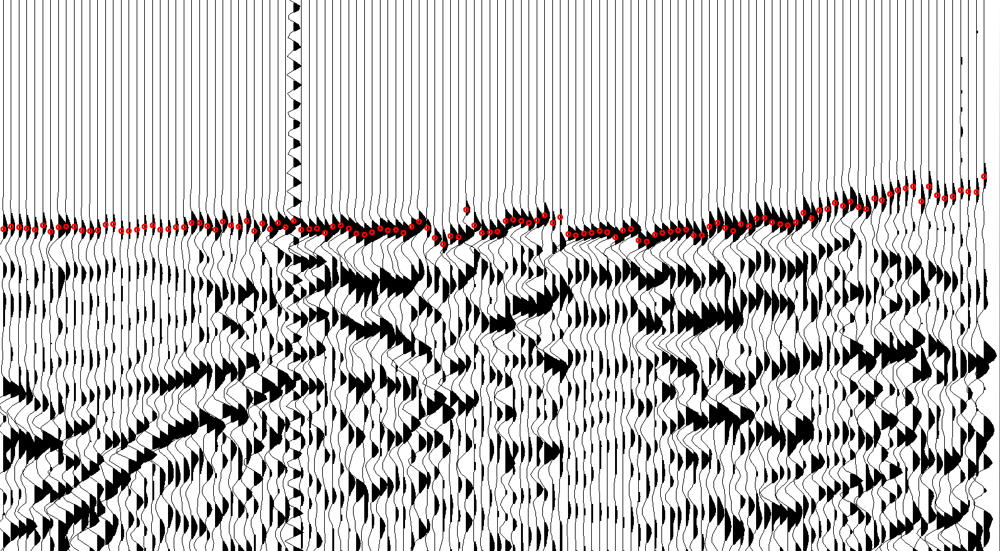
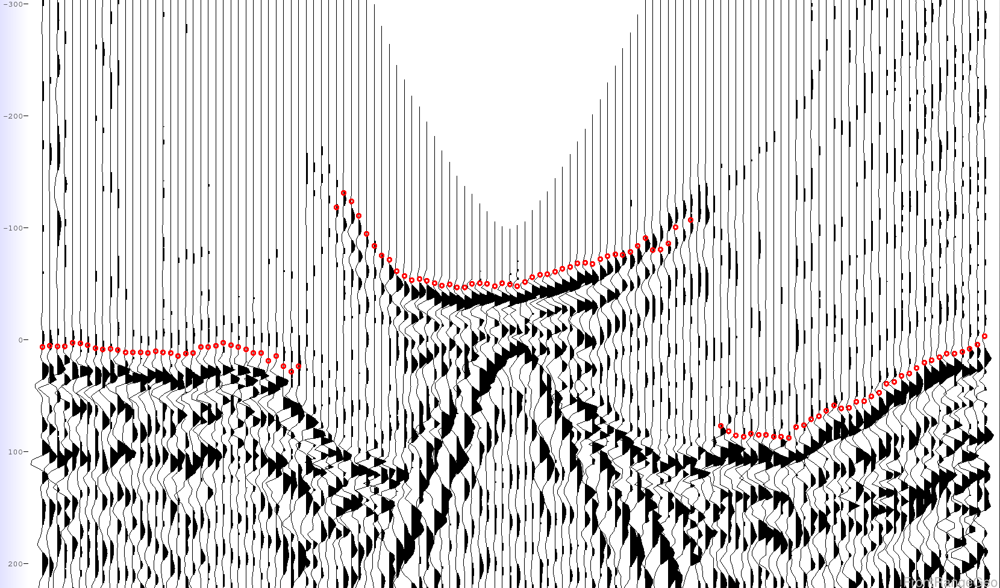
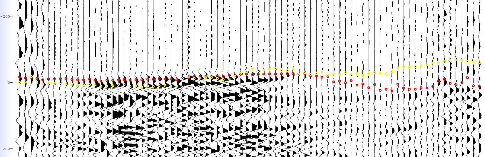
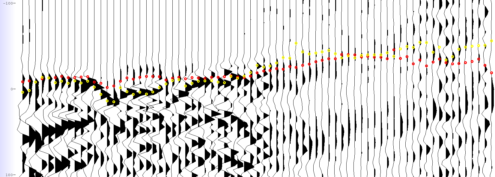
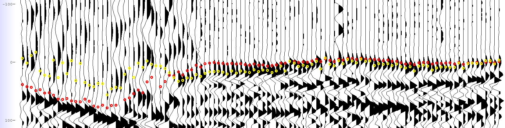
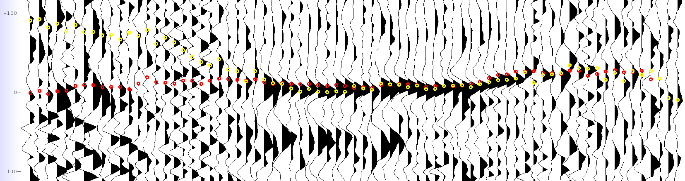
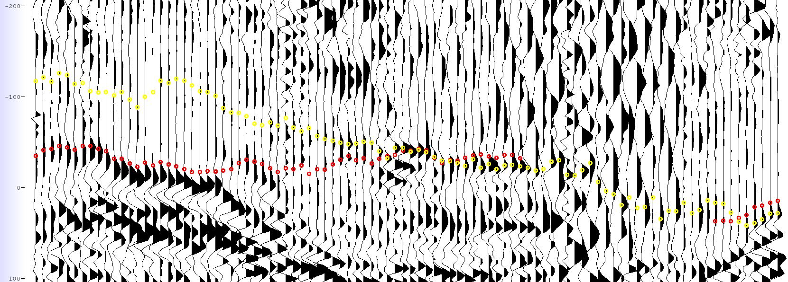
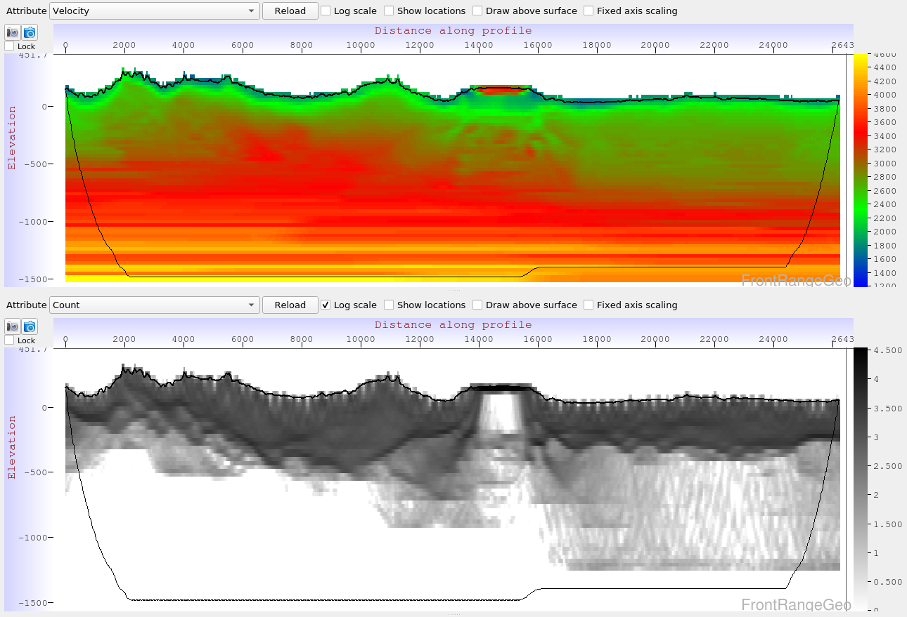
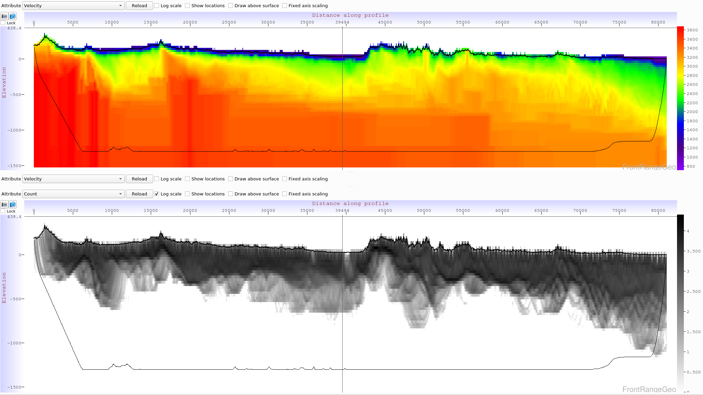

% Report on DeepTrace and Phoenix
<h3 style="text-align-last: center;">Prepared for Geoprocesados  by Front Range Geosciences</h3>

*Velocity inversion found by Phoenix in Geoprocesados data*

## Introduction
Front Range Geosciences provided two software products, Phoenix and DeepTrace, to Geoprocesados for evaluation, and assisted with processing the Furbero3s survey for comparison with prior methods.

### Phoenix
Phoenix is a near-surface geophysical modeling and refraction statics software package that supercedes software such as Flatirons. Phoenix introduces new state-of-the-art tomographic algorithms which produce models of far higher resolution and geologic quality than Flatirons, while simultaneously drastically increasing the speed of nearly all processes.

Every day tasks such as data import and survey merges, delay time and tomographic modeling, picking and QC procedures have all been parallelized and distributed, leading to speedup factors of 10-100x over Flatirons.

### DeepTrace
Geophysicists often spend weeks manually picking and adjusting first breaks in seismic data to produce the highest-quality models. As surveys grow ever-larger in size, this process fails to scale and often becomes a bottleneck in the near-surface processing workflow.

DeepTrace is an AI that leverages modern breakthroughs in computer vision to finally enable automatic picking at human-quality. DeepTrace has been trained on terabytes of manually picked seismic data in a diverse set of geologic contexts and has learned how to pick first breaks "like a human would". DeepTrace's average disagreement with manual human picks is $< 6ms$, approaching the resolution limit of most seismic data.

DeepTrace can pick in hours what humans take weeks, or in some cases months, to process. By scaling GPU compute resources with dataset size, any survey can be automatically picked by DeepTrace, freeing up valuable human time to explore more complex geophysical modeling decisions.

By its nature DeepTrace can continue to learn from new data sources - by training their own copy of DeepTrace on their historical data archives, processors can leverage decades of effort spent picking first breaks to produce DeepTrace models that out-perform humans in most contexts.

## Methodology
Picking first breaks and producing geophysical models in Phoenix is much like the process in Flatirons, in which one cycles through a refinement process going between re-picking and re-modeling.

After applying a human-defined moveout trend to roughly flatten the seismic data, an initial set of DeepTrace picks is generated and used to perform a tomographic inversion. By simulating shot-receiver travel times *inside of the tomo model*, we can get a more precise model-generated moveout trend to better flatten the data, and repick using DeepTrace. By cycling this process a few times, we quickly arrive at an extremely high quality model with very little human effort spent.

Because of the incredbile speedup and quality gains achieved by using Phoenix and DeepTrace, this process can take hours/days instead of weeks/months. The process is as follows:

1. Moveout (human: 10-20 minutes)
2. DeepTrace picks (computer: hours)
3. Tomo Model (computer: hours)
4. DeepTrace (computer: hours)
5. Final Model (computer: hours)
6. QC (human: minutes/hours)

By automating picking and speeding up physical modeling, we free up valuable human operator time to try more modeling ideas, make more complex decisions, and get results faster.

## Results

### Picking
In easy data, DeepTrace performs as expected:

In a complex velocity inversion area, DeepTrace picks much as a human would, jumping legs as the first event fades:

#### Comparison with Human Picks
We found the human picks for this survey to generally be of a very high quality. We compare the human picks (yellow) with DeepTrace (red) in the following images:

 DeepTrace &nbsp;&nbsp; Human

### Modeling
Phoenix introduces a new tomographic inversion algorithm called ANS (Adaptive Node Spacing), which supercedes the VNS algorithm introduced in Flatirons as the industry's most accurate tomography. By dynamically adjusting the model grid during runtime to increase resolution in areas of rapid change, ANS outperforms VNS's static model grids in resolution *where it is needed*.

Velocity profile slices from an ANS model using DeepTrace picks are shown. The black-and-white plots show model grid node hit count, showing where raypaths spend the most time during simulation:

*Profile from the velocity inversion zone*

*Profile along easting*

*Profile along northing*

#### Statics
Comparing statics generated by the ANS model with elevation statics, we can get an idea of the long-wavelength characteristic the tomo model is capturing:

#### Processing
Tomographic inversions were run for 18 iterations on 5 MPI nodes with 32 threads each. Phoenix took about 30 minutes per iteration, for a total of 9 hours per complete model (Lucas can add number of traces and $km^2$). With additional MPI nodes, tomography simlations can be further sped up (according to Amdahl's Law).

We show the lowest error achieved by different ANS models during the demo:

| Pick Type                 | ANS Error (ms) |
|---------------------------|----------------|
| Human                     | 11.127         |
| DeepTrace                 | 9.099          |
| DeepTrace (inner-offsets) | 6.409          |

## Discussion and Pricing
While Phoenix's core improvements over competitive software are its increases in modeling speed and quality, there are many other quality-of-life improvements in Phoenix. Huge survey merges take a tiny fraction of the time they do in competing software, data import and export is much faster, and processes are all independent and can safely fail without affecting the status of others. These improvements and others result in a vastly more usable experience for geophysicists, enabling them to iterate more quickly and produce better results faster.

Front Range Geosciences is now offering Phoenix and DeepTrace as **free installations** with a pay-per-use structure where customers only pay for results if they like and use them. The pricing structure is:

| Software Used                 | \$/$mi^2$ |
|---------------------------|----------------|
| Phoenix                     | 20         |
| DeepTrace                 | 20          |
| Both | 30          | 

