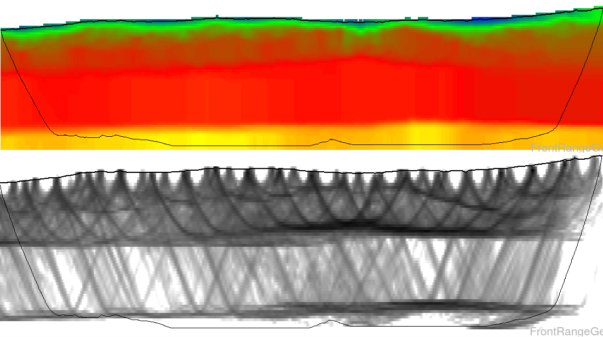

<a href="https://frontrangegeosciences.com/seismicgan/">
<video autoplay playsinline loop muted width="420" class="top" style="width: 50%;margin-left: 25%;float: center">
       <source src="resources/5820.mp4"
            type="video/mp4">
</video></a>

Leveraging our experience as the developers of the industry-standard software suite FLATIRONS, Front Range Geosciences is bringing to market the next generation of near-surface processing technology. Our new products, Phoenix and DeepTrace, increase the speed of processing workflows by **orders of magnitude**, and simultaneously increase their quality and geologic accuracy with brand new geophysical algorithms.

## [DeepTrace](https://frontrangegeosciences.com/DeepTrace/)

DeepTrace is an A.I. designed to pick first breaks in seismic data at human-quality. Using DeepTrace, first break picking time can be reduced from weeks to hours.

## [Phoenix](https://frontrangegeosciences.com/Phoenix/)

Phoenix is the near-surface processing suite for the next decade. 

Bringing the functionality and mature set of tools found in competitive software, Phoenix massively increases processing speeds by allowing unlimited parallelization across distributed computing clusters. Process billions of traces in hours instead of weeks.

---

 contact: [info@frontrangegeosciences.com](mailto:info@frontrangegeosciences.com) | 720-627-5035 | Boulder, CO, USA

