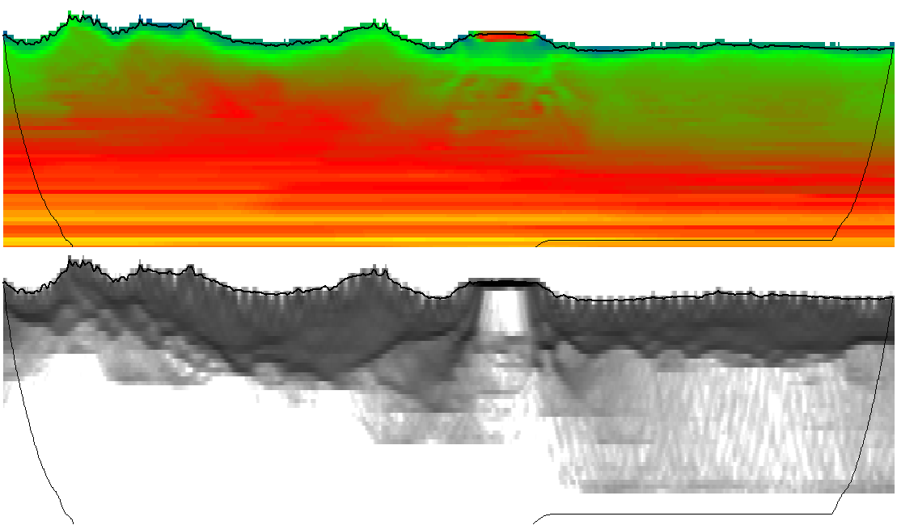
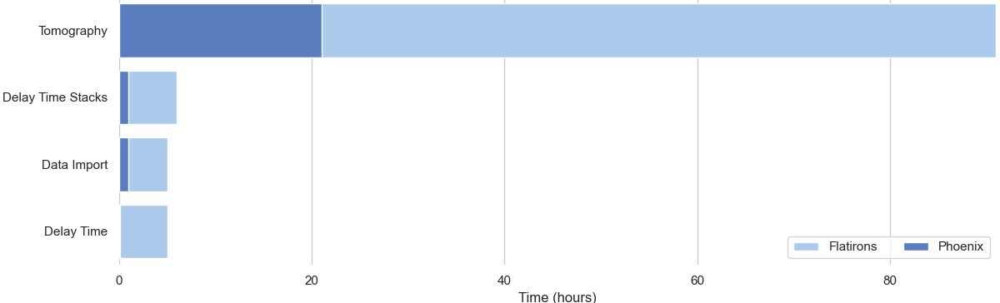
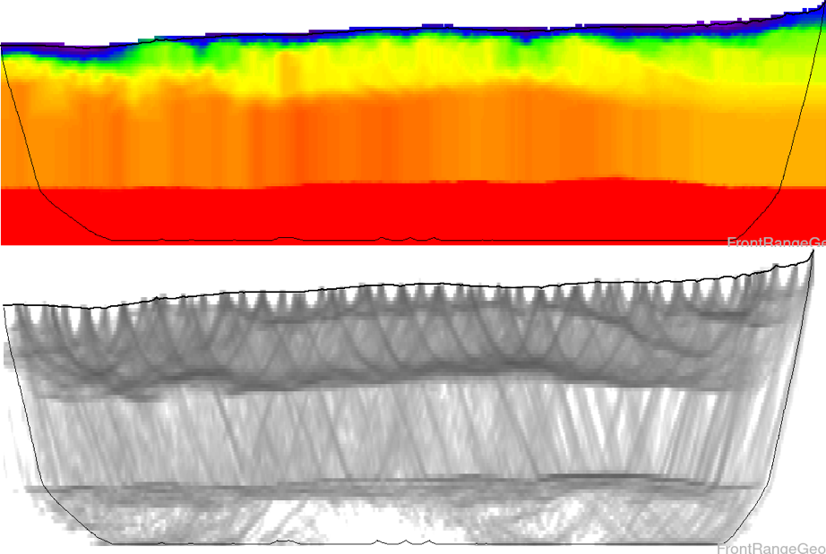
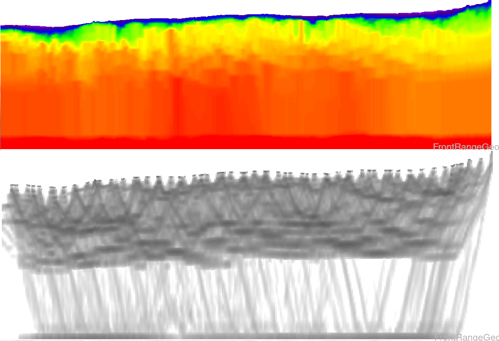
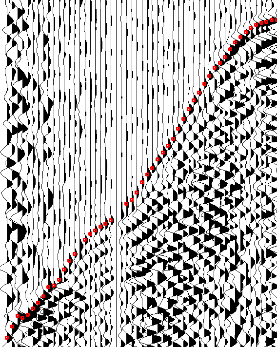
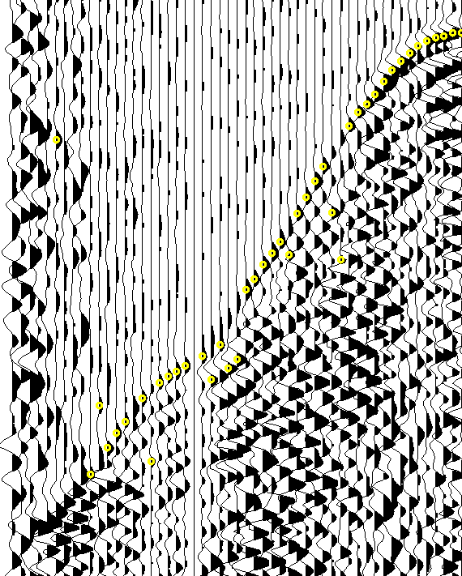

<h1>Phoenix Refraction Statics</h1>

Phoenix is a near surface modeling and refraction statics package designed for the next generation of seismic surveys. Designed to run the largest datasets in hours instead of weeks, Phoenix offers unheard-of&nbsp;performance.  With vastly superior geophysical modeling capabilities, integration of additional well-log data as constraints, and seamless survey merges, Phoenix offers seismic processing options that can't be found anywhere else.  
*Left: Velocity inversion found using Phoenix ANS tomography.*

<h2 style="padding-top: 5px;">Speed</h2>

Every day tasks such as data import and survey merges, delay time and tomographic modeling, picking and QC procedures have all been parallelized and distributed, leading to speedup factors of **10-100x** over competitive software such as Flatirons.

*Right: 400M trace survey, running on 3 node cluster. Phoenix speed advantage scales with compute resources.*

## Quality
Phoenix introduces a brand new tomographic inversion algorithm, Adaptive Node Spacing (ANS), that dynamically adjusts grid resolution to maximize detail in areas where it is needed, and save computation in areas where it is not.

*ANS Tomo slice from Teapot Dome survey  Note improved refractor boundary delineation*

*VNS Tomo slice from Teapot Dome survey*

## Picking
Phoenix integrates directly with Front Range's AI for first break picking, DeepTrace. Automatically pick your largest and noisiest surveys in hours automatically, instead of weeks of manual labor.

*Automatic picking with DeepTrace*

*Traditional threshhold autopicker*

