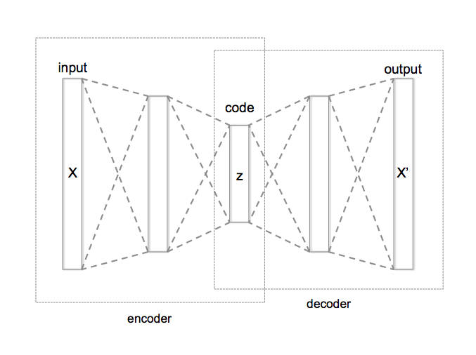

<video autoplay playsinline loop muted width="420" class="top" style="width: 50%;margin-left: 25%;float: center">
       <source src="../resources/5820.mp4"
            type="video/mp4">
</video>

In machine learning we are often trying to get some algorithm or learning system to understand abstract attributes of a data distribution of interest. In our case, seismic data from a wide variety of geologic contexts. 

Unfortunately, it is often the case that labels for a given task are hard to come by. Take first break picking in seismic data: given a set of geophones laid out in a line which have recorded seismic data from a source of vibration, we would like to label the first-arrival of the seismic energy for each trace.

Let's take a look at a typical noisy seismic image:

*We identify the first arrival for each seismic trace with a red dot *

While we can train a neural network to estimate these arrivals when available, often no human-labeled first breaks are available, even if interesting raw seismic data is. In cases like these we still want our neural network to learn *something* from the data, even if the exact task-label is unavailable.

The data itself contains a wealth of geologic information which the neural network could likely extract to improve its internal representation of seismic data in general. We would like to find a way to train the neural network on the raw data without labels, and still have it learn meaningful features and representations which it could transfer to other downstream tasks like first break picking.

## Autoencoders
This is the general idea behind autoencoders, a class of neural networks which attempt to estimate their own input, and in which the data is forced through a network with a *bottleneck layer* in the middle, such that the dimension of the bottleneck (usually denoted $\vec{z}$) is much lower than the dimension of the input data, $\vec{x}$: $\text{dim}(\vec{z}) \ll \text{dim}(\vec{x})$. 

*Autoencoder network diagram[^1]*

In its simplest form, the loss function of a vanilla autoencoder measures how well the input data matches the reconstructed image: $L(\vec{x}) = (\vec{x} - \vec{x}')^2$. By forcing the data to flow through the bottleneck layer, we force the neural network to learn an efficient encoding of the data to some *latent space*, $\vec{z}$, and an efficient decoding from the latent space back to the initial distribution. We call the portions of the network before and after the compact latent space the encoder and decoder, respectively.

By training an autoencoder on all of our data, even where labels are unavailable, we hope that the network learns powerful internal representations, which we can then transfer to another network trained for a particular final task. This kind of pre-training and transfer is called [Transfer Learning](https://en.wikipedia.org/wiki/Transfer_learning).

## Latent Space
Before diving in to how we'll take advantage of transfer learning to help solve our first-break picking task, it's interesting to discuss the concept of the latent space introduced with autoencoders.

*Vibrating strings[^2]*

Latent means "hidden": in machine learning a latent space refers to a space in which dimensions represent abstract features, rather than encoding literal spatial properties. In physics, for example, one can model an arbitrary vibrating string state as a point in Hilbert Space where each dimension corresponds to an overtone of the string - Hilbert Space can be considered as a kind of latent space.

If we imagine training an autoencoder on images of cars, perhaps its latent space would come to represent different manufacturers, so that dimension one is Honda, and dimension two is Ford, and so on. Then the decoder takes the latent space representation and produces the image which was most likely to be encoded into that latent description.

In a typical convolutional neural net for image classification, we can think of the final convolutional layer as the latent space - a space of learned features that are relevant to classifying our image, with the final fully connected layer approximating a *decision boundary in the latent space* for classification.

*Typical CNN classifier network diagram[^3]*

## GANs
Generative Adversarial Networks[^gan1], or GANs, are a kind of generative algorithm that learns to generate samples from a data distribution in a unique way. There is a Generator, $G$, and a Discriminator, $D$, each of which are usually implemented as a neural network. The Generator's goal is to produce realistic seeming samples of the underlying distribution (this could be handwritten digits, human faces, anything...) and the Discriminator's goal is to learn to distinguish real samples from samples generated by the Generator. By pitting the two against each other in a game, their competition drives the Generator to produce realistic samples to fool the Discriminator.

Formally, let $G(\vec{z})$ be a sample produced by the Generator (later we will address what $\vec{z}$, $G$'s input is), and let $D(\vec{x})$ be the Discriminator's opinion about the probability that its input is a real sample, so that $D \in [0,1]$. We want $G(\vec{z}) \sim \vec{x}$. Let $E_{p(\vec{x})}$ represent an expectation over a distribution $p(\vec{x})$, then the GAN loss function is:

$$
\underset{G}{\text{min}} \, \underset{D}{\text{max}} \left( E_{p(\vec{x})} \left [ \log(D(\vec{x}))\right] + E_{p(\vec{z})} \left[ \log(1-D(G(z)))\right] \right )
$$

Unpacking this, notice that $D$ is trying to *maximize* the probability of true samples, while $G$ is trying to *minimize* $\log(1-D(G(\vec{z})))$, which amounts to maximizing $D$'s classification error. The loss function actually encodes a zero-sum minimax game!

Note also that we did not specify what the input to $G$ is. We feed it Gaussian noise, and as if it were the decoder in an autoencoder, we can think of its input as noise in a latent space. By carefully training $G$ and $D$ in turn, $G$ eventually learns to produce quite realistic-seeming samples from the true distribution of data, receiving only noise as input. 

Since the whole network is a differentiable (and therefore continuous) function with respect to its input, which we interpret as a latent space, we can take continuous walks through the latent space and watch as the generator produces continuously varying images which seem to semantically interpolate through abstract features. A popular GAN training set is human faces, so that a walk through latent space produces these unsettling GIFs:

*Continuous walk through latent space in Nvidia's GAN[^4]*

## Seismic GAN
As a powerful general-purpose generative model, we can train a GAN on all kinds of seismic data without the need to worry about task-specific labels! 

Training GANs, however, is notoriously tricky. Everyone's experience seems somewhat different, but a [whole slew](https://github.com/soumith/ganhacks) of [tricks](https://arxiv.org/pdf/1809.11096.pdf#page=23) are known to help stabilize GAN convergence. Personally, I found Spectral Normalization[^5] and avoiding sigmoid activation in the output layer due to clipping[^6] (do BCE directly on the logits) to be the most beneficial hacks, but YMMV.

Finally with our trained generator and discriminator, we can transfer their learned weights to other networks for downstream task finetuning! But before that, let's take a look at some generated samples by walking through latent space à la the face GANs. We get some beautiful generated "dreams" of seismic data:

<video width="420" loop autoplay muted playsinline>
<source src="../seismicdream/3460.mp4" type="video/mp4">
</video>
<video width="420"  loop autoplay muted playsinline>
<source src="../seismicdream/4980.mp4" type="video/mp4">
</video>

<video width="420"  loop autoplay muted playsinline>
<source src="../seismicdream/2860.mp4" type="video/mp4">
</video>
<video width="420"  loop autoplay muted playsinline>
<source src="../seismicdream/3090.mp4" type="video/mp4">
</video>

 

You can find more seismic dreams [here](https://frontrangegeosciences.com/seismicdream/). Happy training!

[^1]: [Autoencoder structure](https://commons.wikimedia.org/wiki/File:Autoencoder_structure.png)

[^2]: [Standing waves on a string](https://commons.wikimedia.org/wiki/File:Standing_waves_on_a_string.gif)

[^3]: [A High-Accuracy Model Average Ensemble of Convolutional Neural Networks for Classification of Cloud Image Patches on Small Datasets](https://www.mdpi.com/2076-3417/9/21/4500)

[^4]: [Progressive Growing of GANs for Improved Quality, Stability, and Variation](https://research.nvidia.com/publication/2017-10_Progressive-Growing-of)

[^gan1]: [Generative Adversarial Networks](https://arxiv.org/abs/1406.2661)

[^5]: [Spectral Normalization for Generative Adversarial Networks](https://arxiv.org/abs/1802.05957)

[^6]: [Sigmoid Activation and Binary Crossentropy — A Less Than Perfect Match?](https://towardsdatascience.com/sigmoid-activation-and-binary-crossentropy-a-less-than-perfect-match-b801e130e31)